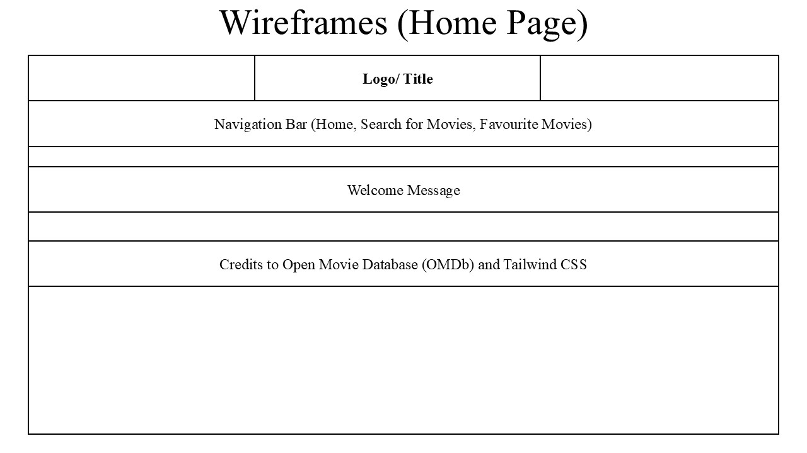
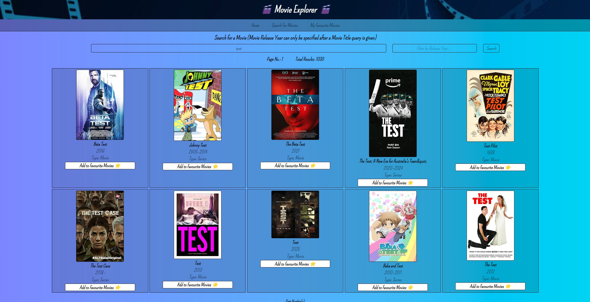

# Movie Explorer React App

## Project Brief

**MVP - Minimum Viable Product**

- Built with React using Components, Props, Routes, etc.
- Calls a public API using Fetch.
- Includes at least 1 C (Create), 1 U (Update) or 1 D (Delete) functionality using Airtable.
- Deployment of App online (Optional)

## Timeframe

1 week

## Technologies & Tools Used

- React JS
- Git & GitHub
- Airtable

## User Stories

- As a user, I should be able to search for a movie of my choice by its title, or release year for better specificity and view its relevant details; such as its title, movie poster, year released and media type (i.e. Movie, Series, Episode).
- As a user, I should be able to view the results of my search term at a glance, with page navigation at the bottom of the page to view the rest of the results in groups of 10 (as per the result limit in the fetched JSON file)
- As a user, I should be able to click on the movie that I want and view it more comprehensively (i.e. Name of Director, Writer(s), Actor(s), Genre(s), IMDb Rating and Full Plot Details).
- As a user, I should be able to keep track of which are my favorite movies. (via Airtable)

## Project Wireframes

## App Screengrabs

## References

- [Open Movie Database API (OMDb)](https://omdbapi.com)
- Styled with [Tailwind CSS](https://tailwindcss.com/)